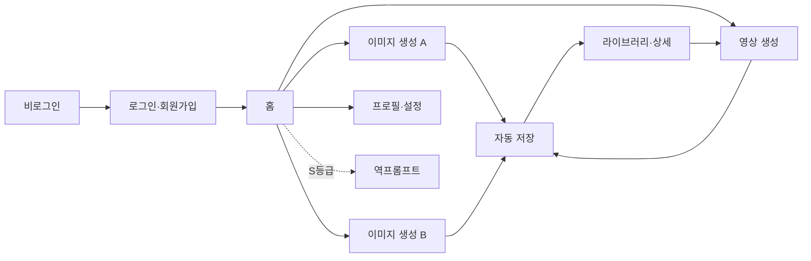

# A2팀 유즈케이스 v0.1

> 기준 문서: 최종 IA v2.1(2026-07-13)
> 작성자: 손찬용 PM
> 목적: 사용자가 서비스에서 달성하려는 목표와 정상·예외 흐름을 기능명세서 작성 전에 합의한다.

## 1. 적용 기준

문서 간 내용이 다르면 아래 순서로 판단한다.

1. `content/01_기획/files/2026-07-13_생성형AI통합엔진_A2_IA_최종본.xlsx`
2. `content/01_기획/2026-07-13_A2팀_핸드오프.md`
3. `content/01_기획/2026-06-24_생성형_AI_통합_엔진_PRD.md`
4. `content/01_기획/2026-07-07_A2팀_화면별_옵션값_확정.md`
5. `content/03_엔지니어링/2026-07-03_A2팀_API_DB_명세서.md`

최종 IA에서 제외한 구독 메뉴·구독 화면은 이 문서의 범위에 포함하지 않는다. 라이브러리 필터·공유 링크처럼 `후속안건`으로 표시된 기능은 정책 확정 전 구현 범위로 보지 않는다.

## 2. 액터

| 액터 | 설명 |
| --- | --- |
| 비로그인 사용자 | 로그인 또는 회원가입을 통해 서비스 진입을 시도하는 사용자 |
| 로그인 사용자 | 이미지·영상 생성, 라이브러리, 프로필 기능을 사용하는 기본 사용자 |
| 생성 API | 이미지·영상·역프롬프트 생성 요청을 처리하는 외부/백엔드 시스템 |
| 저장 시스템 | 생성 결과와 메타데이터를 라이브러리에 저장·조회·삭제하는 시스템 |

## 3. 전체 흐름

## 4. 유즈케이스 목록

| ID | 유즈케이스 | 주 액터 | 범위 상태 | IA 근거 |
| --- | --- | --- | --- | --- |
| UC-01 | 로그인 | 비로그인 사용자 | 확정 | IA-001, IA-079 |
| UC-02 | 회원가입 | 비로그인 사용자 | 확정 | IA-002, IA-080 |
| UC-03 | 홈에서 기능 탐색·진입 | 로그인 사용자 | 확정 | IA-003~015 |
| UC-04 | 초기 레퍼런스 이미지 생성 | 로그인 사용자 | 확정 | IA-016~024, IA-081~082 |
| UC-05 | 키이미지 생성 | 로그인 사용자 | 확정 | IA-025~029, IA-081~082 |
| UC-06 | 생성 결과 관리 | 로그인 사용자 | 확정 | IA-030~035, IA-049~054 |
| UC-07 | 스토리보드 영상 생성 | 로그인 사용자 | 부분확정 | IA-036~048, IA-083~084 |
| UC-08 | 라이브러리 조회·상세 사용 | 로그인 사용자 | 부분확정 | IA-055~068, IA-085~086 |
| UC-09 | 프로필·보안·활동 관리 | 로그인 사용자 | 확정 | IA-076, IA-087~088 |
| UC-10 | 계정 삭제 | 로그인 사용자 | 정책확인 | IA-077 |
| UC-11 | 역프롬프트로 이미지 재생성 | 로그인 사용자 | S등급 도전 | IA-069~075 |
| UC-12 | 작업물 공유 | 로그인 사용자 | 후속안건 | IA-078 |

## 5. 상세 유즈케이스

### UC-01 로그인

| 항목 | 내용 |
| --- | --- |
| 목표 | 기존 사용자가 인증을 완료하고 홈으로 이동한다. |
| 사전조건 | 사용자가 로그아웃 상태이며 등록된 이메일 계정이 있다. |
| 시작조건 | 사용자가 로그인 화면에서 이메일과 비밀번호를 제출한다. |
| 완료조건 | 인증 성공 후 홈이 표시되고 로그인 전용 메뉴를 사용할 수 있다. |

기본 흐름:

1. 사용자가 이메일과 비밀번호를 입력한다.
2. 시스템이 필수값과 형식을 검증한다.
3. 시스템이 인증을 요청한다.
4. 인증 성공 시 홈으로 이동한다.

대체·예외 흐름:

- 입력값이 없거나 형식이 잘못되면 입력을 유지하고 오류를 표시한다.
- 인증이 실패하면 계정 정보가 일치하지 않는다는 안내를 표시한다.

### UC-02 회원가입

| 항목 | 내용 |
| --- | --- |
| 목표 | 신규 사용자가 이메일 확인과 비밀번호 설정을 완료한다. |
| 사전조건 | 사용자가 로그아웃 상태다. |
| 시작조건 | 사용자가 회원가입을 선택한다. |
| 완료조건 | 가입 완료 후 로그인 또는 홈 이동이 가능한 상태가 된다. |

기본 흐름:

1. 사용자가 이메일을 입력하고 확인 절차를 진행한다.
2. 사용자가 비밀번호를 설정한다.
3. 시스템이 약관·개인정보 모달을 표시한다.
4. 사용자가 필수 동의를 완료한다.
5. 시스템이 계정을 생성하고 완료 화면을 표시한다.

대체·예외 흐름:

- 이미 사용 중인 이메일이면 가입을 중단하고 안내한다. Google로 가입된 이메일도 사용 중으로 처리한다. (이메일-가입 방식 배타, 2026-07-15 확정)
- 이메일 확인 또는 필수 동의가 끝나지 않으면 가입을 완료하지 않는다.

### UC-03 홈에서 기능 탐색·진입

| 항목 | 내용 |
| --- | --- |
| 목표 | 사용자가 서비스의 주요 기능과 최근 작업물을 확인하고 원하는 화면으로 이동한다. |
| 사전조건 | 로그인 상태다. |
| 시작조건 | 로그인 성공 또는 사이드바의 홈 선택 |
| 완료조건 | 이미지 A·이미지 B·영상·라이브러리 중 선택한 화면으로 이동한다. |

기본 흐름:

1. 시스템이 서비스 소개, 주요 생성 CTA, 최근 작업물을 표시한다.
2. 사용자가 생성 CTA 또는 고정 사이드바 메뉴를 선택한다.
3. 시스템이 선택한 화면으로 이동한다.
4. 최근 작업물을 선택하면 공통 상세 모달을 표시한다.

### UC-04 초기 레퍼런스 이미지 생성

| 항목 | 내용 |
| --- | --- |
| 목표 | 사용자가 자유 프롬프트와 옵션으로 캐릭터·배경 초기 레퍼런스를 생성한다. |
| 사전조건 | 로그인 상태이며 이미지 생성 메뉴 A에 진입했다. |
| 시작조건 | 사용자가 생성 요청을 선택한다. |
| 완료조건 | 결과가 화면에 표시되고 라이브러리에 자동 저장된다. |

기본 흐름:

1. 사용자가 한국어 또는 영어 프롬프트를 입력한다.
2. 필요하면 레퍼런스 이미지를 첨부한다.
3. 사용자가 프롬프트 향상 ON/OFF, 비율, 품질을 선택한다.
4. ON이면 시스템이 Claude Sonnet을 통해 영어 최적화 프롬프트로 변환한다.
5. 시스템이 이미지 생성 요청을 보내고 스피너를 표시한다.
6. 생성 성공 시 배경 이미지 또는 캐릭터 다각도 결과를 표시한다.
7. 시스템이 결과와 실제 생성 프롬프트를 라이브러리에 자동 저장한다.

대체·예외 흐름:

- 빈 프롬프트, 지원하지 않는 파일 형식·용량이면 입력을 유지하고 오류를 표시한다.
- 생성 API가 실패하면 동일 입력으로 재시도할 수 있게 한다.
- 프롬프트 향상 결과의 생성 전 노출·수정 여부는 별도 확정이 필요하다.

### UC-05 키이미지 생성

| 항목 | 내용 |
| --- | --- |
| 목표 | 사용자가 속성값과 자유 텍스트로 캐릭터 키이미지를 생성한다. |
| 사전조건 | 로그인 상태이며 이미지 생성 메뉴 B에 진입했다. |
| 시작조건 | 사용자가 생성 요청을 선택한다. |
| 완료조건 | 턴어라운드·표정·소품·컬러팔레트가 포함된 결과 1장이 표시·자동 저장된다. |

기본 흐름:

1. 시스템이 기본값이 채워진 속성 선택 사이드바를 표시한다.
2. 사용자가 캐릭터 기본, 세계관, 헤어, 얼굴, 의상·악세서리 값을 조정한다.
3. 사용자가 필요하면 자유 텍스트 프롬프트와 프롬프트 향상을 사용한다.
4. 시스템이 고정값(1장, 흰 배경, 정면·측면·후면)과 사용자 입력을 조합한다.
5. 시스템이 생성 요청을 보내고 결과를 표시한다.
6. 시스템이 결과를 라이브러리에 자동 저장한다.

대체·예외 흐름:

- 악세서리만 복수 선택할 수 있고 나머지 속성은 단일 선택한다.
- 인간형 외 캐릭터는 이번 범위에서 지원하지 않는다.
- 필수 속성 또는 프롬프트가 유효하지 않으면 오류를 표시하고 입력을 유지한다.

### UC-06 생성 결과 관리

| 항목 | 내용 |
| --- | --- |
| 목표 | 사용자가 이미지·영상 결과를 재사용하거나 정리한다. |
| 사전조건 | 생성 결과 또는 작업물 상세가 표시되어 있다. |
| 완료조건 | 선택한 찜하기·다운로드·복사·재편집·삭제·재생성 액션이 처리된다. |

기본 흐름:

1. 사용자가 결과 액션을 선택한다.
2. 시스템은 선택에 따라 즐겨찾기 토글, 파일 다운로드, 프롬프트 복사, 재편집, 삭제 또는 재생성을 수행한다.
3. 재생성 결과는 기존 결과를 덮어쓰지 않고 새 작업물로 자동 저장한다.

대체·예외 흐름:

- 삭제는 확인 절차 후 처리하며 실제 파일·DB 삭제 범위는 정책 확정이 필요하다.
- 저장 실패 시 결과 유지·재시도 방식과 중복 저장 방지 기준은 BE 확인이 필요하다.

### UC-07 스토리보드 영상 생성

| 항목 | 내용 |
| --- | --- |
| 목표 | 사용자가 3×3 스토리보드와 프롬프트로 영상을 생성한다. |
| 사전조건 | 로그인 상태이며 번호 오버레이가 없는 3×3 그리드 이미지 1장과 프롬프트를 준비했다. |
| 시작조건 | 사용자가 영상 생성 요청을 선택한다. |
| 완료조건 | 완성 영상을 미리보고 라이브러리에서 다시 확인할 수 있다. |

기본 흐름:

1. 사용자가 3×3 그리드 이미지 1장을 업로드한다.
2. 사용자가 영상 프롬프트를 입력한다. 영상 화면에는 프롬프트 향상 기능을 제공하지 않는다.
3. 사용자가 Kling 3.0 또는 Seedance 2.0과 지원되는 길이·비율·해상도를 선택한다.
4. 시스템이 모델별 지원값을 검증하고 생성 요청을 보낸다.
5. 처리 중에는 퍼센트가 아닌 진행 표시를 제공한다.
6. 완료 시 영상을 미리보기로 표시하고 자동 저장한다.
7. 실패 시 실패 상태와 재시도 액션을 표시한다.

대체·예외 흐름:

- 3×3 이미지, 프롬프트 또는 필수 옵션이 없으면 요청하지 않는다.
- 지원하지 않는 옵션은 비활성화하거나 검증 오류를 표시한다.
- 일일 한도·크레딧은 적용하지 않는다. 한도 차단 흐름은 없다. (2026-07-15 확정)
- 내부 처리 방식, Kling 비율 UI·오디오, 진행 표시 방식은 후속 확정이 필요하다.

### UC-08 라이브러리 조회·상세 사용

| 항목 | 내용 |
| --- | --- |
| 목표 | 사용자가 자동 저장된 이미지·영상을 찾아보고 다음 작업에 활용한다. |
| 사전조건 | 로그인 상태다. |
| 시작조건 | 사용자가 라이브러리를 선택한다. |
| 완료조건 | 선택한 작업물의 상세 정보와 가능한 액션을 확인한다. |

기본 흐름:

1. 시스템이 이미지·영상 혼합 그리드를 표시한다.
2. 사용자가 작업물을 선택한다.
3. 시스템이 미디어, 생성 프롬프트, 모델, 품질, 비율, 해상도, 생성일을 공통 상세 모달에 표시한다.
4. 사용자는 찜하기, 다운로드, 재생성, 이미지의 영상 생성 연결, 삭제를 선택할 수 있다.

대체·예외 흐름:

- 저장된 작업물이 없으면 빈 상태와 생성 화면 이동 CTA를 표시한다.
- 전체·이미지·영상·찜한 것 필터와 최신순 정렬은 와이어프레임·개발 협의 후 확정한다.

### UC-09 프로필·보안·활동 관리

| 항목 | 내용 |
| --- | --- |
| 목표 | 사용자가 자신의 기본 정보, 로그인 방식, 생성 활동을 확인·관리한다. |
| 사전조건 | 로그인 상태다. |
| 완료조건 | 닉네임 변경이 반영되고, 가입 방식을 확인할 수 있으며, 활동에서 라이브러리로 이동할 수 있다. |

기본 흐름:

1. 시스템이 프로필 이미지, 닉네임, 이메일을 표시한다.
2. 사용자가 닉네임을 수정·저장한다. 이메일은 읽기 전용으로 표시한다.
3. 사용자는 자신의 가입 방식(일반/Google)을 확인할 수 있다. 한 이메일은 한 가입 방식만 가지므로 계정 연결·해제는 제공하지 않는다. (2026-07-15 확정)
4. 시스템이 내 생성 이미지의 최근 생성일과 라이브러리 바로가기를 표시한다.

범위 제외:

- 구독 상태·플랜과 구독 관련 화면은 최종 IA에서 제외됐다.

### UC-10 계정 삭제

| 항목 | 내용 |
| --- | --- |
| 목표 | 사용자가 계정과 관련 데이터의 영구 삭제를 요청한다. |
| 사전조건 | 로그인 상태이며 프로필·설정 화면에 있다. |
| 완료조건 | 확인 절차와 필요한 재인증을 통과한 뒤 정책에 따라 데이터가 삭제된다. |

기본 흐름:

1. 사용자가 계정 삭제를 선택한다.
2. 시스템이 영구 삭제와 복구 불가 내용을 확인 모달로 표시한다.
3. 사용자가 동의하고 필요한 인증을 완료한다.
4. 시스템이 계정 삭제를 처리하고 로그아웃 상태로 전환한다.

확인 필요:

- 소프트/하드 삭제, 생성 파일·S3·라이브러리·계정 데이터 삭제 범위와 재인증 기준

### UC-11 역프롬프트로 이미지 재생성

| 항목 | 내용 |
| --- | --- |
| 목표 | 사용자가 이미지를 분석해 프롬프트를 추출·수정하고 같은 화면에서 재생성한다. |
| 사전조건 | 로그인 상태이며 S등급 도전 기능이 활성화됐다. |
| 완료조건 | 재생성 결과가 표시되고 라이브러리에 자동 저장된다. |

기본 흐름:

1. 사용자가 분석할 이미지를 업로드한다.
2. 시스템이 이미지를 분석하고 프롬프트를 추출한다.
3. 사용자가 추출 프롬프트를 수정한다.
4. 사용자가 같은 화면에서 재생성을 요청한다.
5. 시스템이 결과를 표시하고 자동 저장한다.

### UC-12 작업물 공유

| 항목 | 내용 |
| --- | --- |
| 목표 | 사용자가 작업물 상세를 링크로 공유한다. |
| 범위 상태 | 후속안건 — 정책 확정 전 구현 보류 |
| IA 근거 | IA-078 |

확정 전 확인 항목:

- 공개 범위, 링크 만료, 링크 삭제 권한
- 비로그인 접근 허용 여부
- 원본 다운로드 허용 여부

## 6. 공통 정책

| 정책 | 기준 |
| --- | --- |
| 인증 | 생성·라이브러리·프로필 기능은 로그인 후 사용한다. |
| 자동 저장 | 이미지·영상·역프롬프트 재생성 결과는 생성 성공 시 자동 저장한다. |
| 찜하기 | 저장 버튼이 아니라 저장된 작업물의 즐겨찾기 토글이다. |
| 재생성 | 기존 작업물을 덮어쓰지 않고 새 작업물로 저장한다. |
| 영상 진행 | 가짜 퍼센트를 사용하지 않는다. 표시 방식은 스피너·경과시간 중 확정한다. |
| 한도 | 일일 한도·크레딧을 적용하지 않는다. 카운터·초과 차단 로직 없음. (2026-07-15 확정) |
| 미확정 정책 | 확정 전에는 기능명세서에 구현 규칙처럼 쓰지 않고 확인필요 항목으로 관리한다. |

## 7. 다음 검토 순서

1. PM·UX/UI: 영상 진행 표시와 라이브러리 필터·정렬 방식
2. PM·BE: 영상 내부 처리, Kling 비율·오디오, 자동 저장 실패 처리
3. PM·BE·보안 담당: 공유 링크와 삭제·탈퇴 정책
4. 검토 결과를 기능명세서와 최종 IA 후속안건에 동시에 반영
