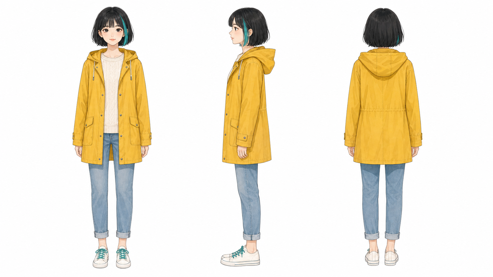
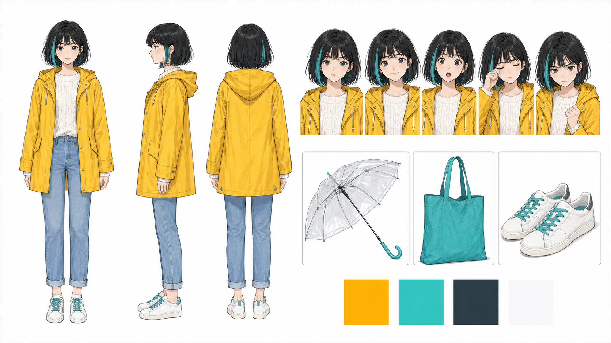
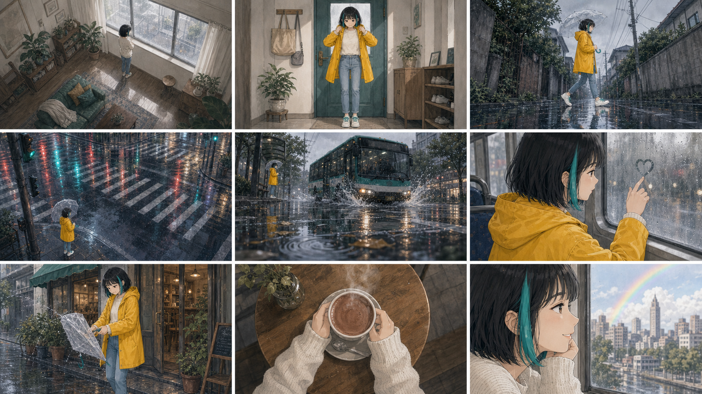

# A2팀 온보딩 프리셋·How-to 가이드 v0.2

> 목적: 처음 방문한 사용자가 서비스가 무엇을 하는지 이해하고, 예시를 고른 뒤 첫 이미지 생성까지 자연스럽게 이동하도록 한다.
> 상태: **PM 제안 — 팀 합의 및 기능명세 반영 전에는 구현 확정으로 보지 않는다.**
> 근거: 현재 IA·기능명세서에는 히어로, 프리셋 4종, 프리셋 클릭 시 초깃값 주입 행이 없다. UX/UI·FE 합의 후 기능명세서에 반영될 때 확정으로 전환한다.
> 확정 정책: 이미지 프롬프트 향상 결과는 생성 전에 사용자에게 노출하지 않으며, 영상 생성 프롬프트는 변환 없이 원문을 사용한다.

## 1. 방향

아래 방향은 **온보딩 제안안**이다. 기능 목록을 읽게 하기보다 결과를 먼저 보여주고 다음 행동을 선택하게 하는 구성을 검토한다.

| 원칙 | 적용 방식 |
| --- | --- |
| 쉬운 첫 문장 | 전문 용어 없이 이미지와 짧은 영상을 만들 수 있다는 점을 설명한다. |
| 결과 먼저 | 실제 생성된 캐릭터·배경·키이미지·스토리보드를 먼저 보여준다. |
| 선택지는 적게 | `이미지부터 만들기`와 `영상 흐름 보기` 두 CTA만 우선 노출한다. |
| 실제 기능만 안내 | 이미지에는 프롬프트 향상이 있고 영상에는 없다는 현재 기능 기준을 지킨다. |
| 작업 연결 강조 | 생성 결과가 라이브러리에 자동 저장되고 다음 생성에 다시 사용되는 흐름을 보여준다. |

## 2. 히어로 구성안

### 메인 카피

> 떠오른 장면을 이미지로 만들고, 이야기의 흐름을 짧은 영상으로 이어보세요.

### 보조 카피

> 어려운 제작 경험이 없어도 프롬프트와 참고 이미지로 캐릭터, 배경, 스토리보드와 영상을 만들 수 있습니다.

### CTA

| 우선순위 | 문구 | 이동 |
| --- | --- | --- |
| 1 | 이미지부터 만들기 | 이미지 생성 메뉴 A |
| 2 | 영상 만드는 과정 보기 | 온보딩 How-to 영상 또는 단계 안내 |

## 3. 온보딩 프리셋 4종

아래 4종은 현재 내부 테스트 자산으로 만든 **제안 예시**이며 최종 카테고리 전체를 뜻하지 않는다. 프리셋 클릭 시 생성 화면 이동과 초깃값 주입도 기능명세 반영 전까지는 구현 요구사항이 아니다.

### 프리셋 제작 방향 합의

- 무료 플랫폼의 프리셋을 긁어오거나 그대로 옮기는 방식은 중단한다.
- 외부 플랫폼은 카테고리 구성 방식만 참고한다.
- 실제 프리셋 이미지와 프롬프트는 GPT를 이용해 자체 생성한다.
- 이슬기 PM이 정리할 카테고리 틀에 이 문서의 `소연` 4종을 예시 자산으로 매핑한다.
- 카테고리 틀이 정해지기 전에는 `소연` 4종을 최종 프리셋 세트로 확정하지 않는다.

### PRESET-01 캐릭터 시작

- 목적: 캐릭터 정면·측면·후면을 한 장에서 빠르게 확인
- 이동: 이미지 생성 메뉴 A
- 시작 문구: `검정 단발머리와 틸 색 브릿지, 머스터드 레인코트를 입은 20대 여성 캐릭터를 정면·측면·후면으로 보여줘.`
- 기본값: 캐릭터 / 16:9 / 표준 / 프롬프트 향상 ON

### PRESET-02 배경 시작

- 목적: 인물 없는 장면 배경 생성
- 이동: 이미지 생성 메뉴 A
- 시작 문구: `비가 내린 이른 아침의 조용한 도시 골목을 만들어줘. 젖은 도로에 따뜻한 가게 불빛이 비치고 사람은 없게 해줘.`
- 기본값: 배경 / 16:9 / 표준 / 프롬프트 향상 ON

### PRESET-03 캐릭터 자세히 만들기

- 목적: 턴어라운드·표정·소품·색상을 한 장에서 확인
- 이동: 이미지 생성 메뉴 B
- 시작 방식: 속성 선택 또는 자유 텍스트
- 기본값: 16:9 / 고화질 / 프롬프트 향상 ON

### PRESET-04 영상 흐름 시작

- 목적: 9개 컷이 3×3으로 들어있는 단일 이미지와 프롬프트로 영상 생성 흐름 이해
- 이동: 영상 생성
- 입력: 번호 오버레이가 없는 3×3 스토리보드 이미지 1장
- 주의: 영상 생성 화면에는 프롬프트 향상을 제공하지 않고 입력 문장을 그대로 사용한다.

## 4. 프리셋 노출 메타데이터

프리셋 카드 또는 상세에 아래 항목을 노출한다.

| 항목 | 노출 기준 |
| --- | --- |
| 생성자 | 실명 대신 랜덤 표시명 사용 |
| 품질 | 생성 결과의 품질 값 표시 |
| 사이즈 | 결과 이미지 또는 영상의 출력 크기 표시 |
| 생성일자 | 프리셋 생성일 표시 |
| 프롬프트 | 사용자가 참고·재사용할 수 있는 프롬프트 표시 |
| 모델 | **노출하지 않음** |

메타데이터 스펙은 확정 사항이며, 구체적인 카드 배치와 표시명 생성 규칙은 UX/UI·FE가 구현 전 정리한다.

## 5. 30초 How-to 영상 구성

| 구간 | 화면 | 핵심 메시지 | 화면 자막 후보 |
| --- | --- | --- | --- |
| 00~04초 | 네 프리셋 결과를 빠르게 보여줌 | 만들 수 있는 결과를 먼저 이해 | `아이디어를 이미지와 영상으로` |
| 04~09초 | 한국어 프롬프트 입력·프롬프트 향상 ON | 짧은 문장으로 시작 가능 | `한국어로 장면을 적어보세요` |
| 09~14초 | 캐릭터·배경 결과 표시 | 첫 레퍼런스 생성 | `캐릭터와 배경 만들기` |
| 14~19초 | 메뉴 B 키이미지 표시 | 캐릭터 세부 일관성 확보 | `캐릭터를 더 자세하게` |
| 19~25초 | 3×3 스토리보드 업로드·영상 생성 요청 | 컷 흐름을 영상으로 연결 | `9개 컷의 흐름을 영상으로` |
| 25~30초 | 결과와 라이브러리 이동 | 자동 저장·이어 만들기 | `결과는 라이브러리에 자동 저장` |

### 제작 원칙

- 04~09초 구간에서는 한국어 원문 입력과 `프롬프트 향상 ON` 상태만 보여준다. 내부에서 변환된 영어 프롬프트를 화면에 노출하거나 사용자가 수정하는 연출은 사용하지 않는다.
- 실제 UI가 확정되기 전에는 클릭 위치나 버튼 모양을 영상에 고정하지 않는다.
- 생성 대기 화면은 실제 처리 시간을 숨기지 않되 확정되지 않은 진행률 퍼센트를 쓰지 않는다.
- 영상은 무음으로 봐도 이해되도록 짧은 자막을 제공하고, 음성·배경음은 보조로 사용한다.
- 특정 연령층이나 전문 제작자만을 전제로 한 표현을 피한다.

## 6. 온보딩 제안 검토·완료 기준

- [ ] PM·UX/UI·FE가 히어로·프리셋·CTA·초깃값 주입 범위를 합의한다.
- [ ] 합의된 프리셋 기능을 기능명세서 DB에 별도 행으로 추가한다.
- [ ] 처음 화면에서 이미지·영상 생성 서비스임을 이해할 수 있다.
- [ ] 첫 CTA가 이미지 생성 메뉴 A로 연결된다.
- [ ] 네 프리셋의 이미지와 이동 대상이 일치한다.
- [ ] 이미지 프롬프트 향상과 영상 원문 투입의 차이가 잘못 안내되지 않는다.
- [ ] 영상 입력이 `9개 컷이 3×3으로 들어있는 단일 이미지`임을 명확히 보여준다.
- [ ] 생성 결과가 라이브러리에 자동 저장된다는 현재 흐름을 안내한다.
- [ ] 모바일에서도 카피·프리셋·CTA의 우선순위가 유지된다.

## 7. 전달 대상별 사용

| 대상 | 전달 내용 |
| --- | --- |
| UX/UI | 제안안을 검토하고 합의 전까지 확정 화면으로 제작하지 않음. 메타데이터 배치안 검토 |
| FE | 기능명세 행 추가 전에는 프리셋 이동·초깃값 주입을 구현 범위로 보지 않음 |
| BE | 온보딩 자체 추가 API 없음. 실제 생성 화면의 기존 요청·응답 사용 |
| PM | 이슬기 PM의 카테고리 틀과 자체 생성 프리셋 연결, 팀 합의 후 기능명세 반영 |
